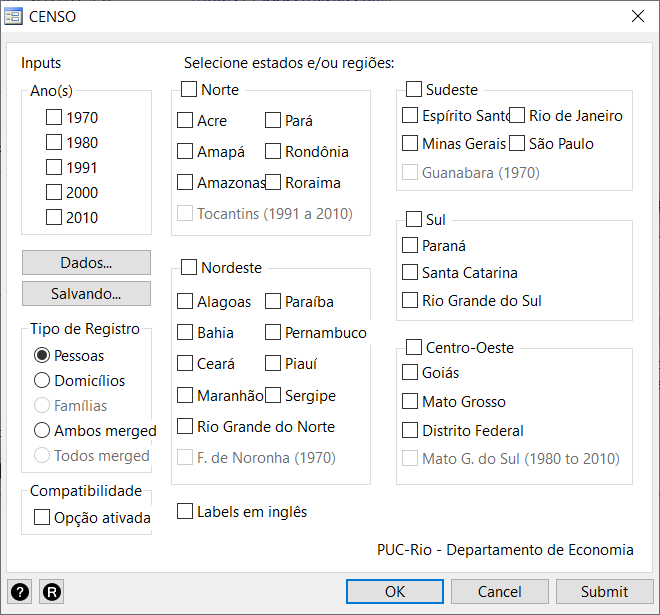
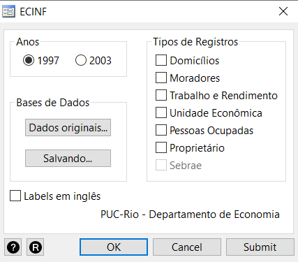
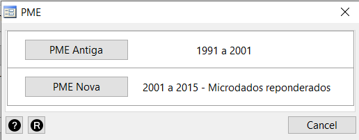
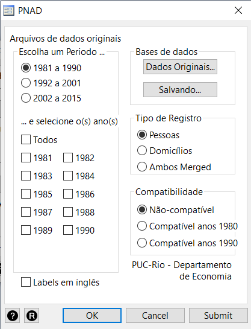
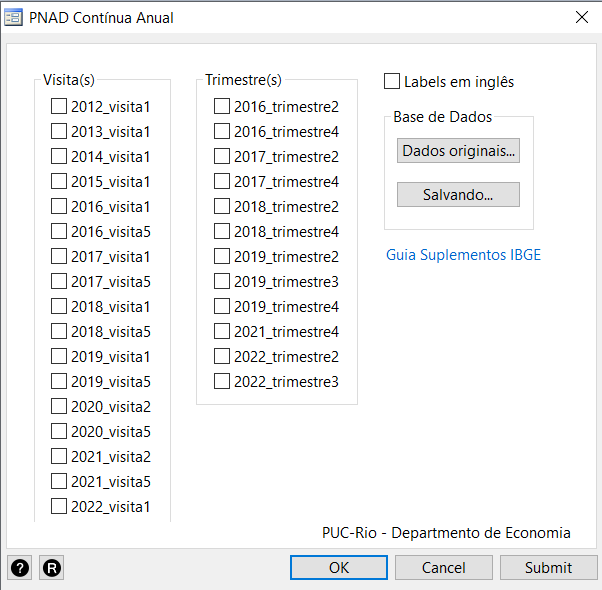
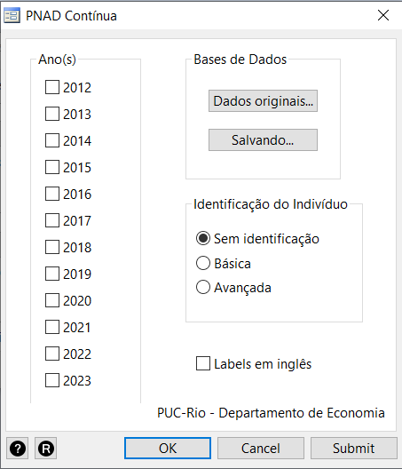
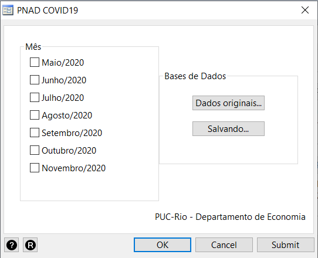
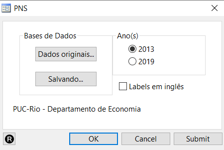
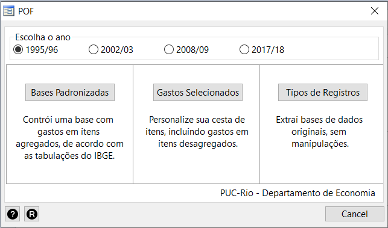

<!-- README.md is generated from README.Rmd. Please edit that file -->

# datazoom_social

<!-- badges: start -->

<!-- badges: end -->

O `datazoom_social` é um pacote que compatibiliza microdados de
pesquisas realizadas pelo IBGE. Com o pacote, é possível fazer a leitura
de todas as pesquisas domiciliares realizadas pelo IBGE: Censo
Demográfico, Pesquisa Nacional por Amostra de Domicílios, Pesquisa
Mensal do Emprego, Pesquisa de Orçamentos Familiares e Pesquisa de
Economia Informal Urbana.

## Instalação 

Digite o código abaixo na linha de comando do Stata para baixar e
instalar a versão mais recente do pacote

    net install datazoom_social, from("https://raw.githubusercontent.com/datazoompuc/datazoom_social_stata/master/") force

## Uso

Todas as funções do pacote podem ser usadas pelas caixas de diálogo.
Para acessá-las, digite o comando

    db datazoom_social

Clique nos botões abaixo para ir à explicação de cada função.

|                                                                                                                                                                                    |                                                                                                                                                                 |                                                                                                                                                             |                                                                                                                                                                    |
|:----------------------------------------------------------------------------------------------------------------------------------------------------------------------------------:|:---------------------------------------------------------------------------------------------------------------------------------------------------------------:|:-----------------------------------------------------------------------------------------------------------------------------------------------------------:|:------------------------------------------------------------------------------------------------------------------------------------------------------------------:|
| <a href = "#censo-demográfico"> <kbd>       Censo        </kbd> </a>     <small> Censo Demográfico </small>   <small> 1970 a 2010 </small> |  [<kbd>       ECINF        </kbd>](#ecinf)    <small> Economia Informal Urbana </small>   <small> 1997 e 2003 </small>  | [<kbd>       PME        </kbd>](#pme)    <small> Pesquisa Mensal de Emprego </small>   <small> 1990 a 2015 </small> |           [<kbd>       PNAD        </kbd>](#pnad)    <small> PNAD Antiga </small>   <small> 2001 a 2015 </small>           |
|    <a href = "#pnad-contínua"> <kbd>    PNAD Contínua     </kbd> </a>    <small> PNAD Contínua </small>   <small> 2012 a 2023 </small>     | <a href = "#pnad-covid"> <kbd>      PNAD Covid       </kbd> </a>    <small> PNAD Covid </small>   <small> 2020 </small> | [<kbd>       PNS        </kbd>](#pns)    <small> Pesquisa Nacional de Saúde </small>   <small> 2013 e 2019 </small> | [<kbd>       POF        </kbd>](#pof)    <small> Pesquisa de Orçamentos Familiares </small>   <small> 1995 a 2018 </small> |

 

## Censo Demográfico

## ECINF

## PME

## PNAD

## PNAD Contínua

 

## PNAD Covid

## PNS

## POF

## Programas Auxiliares (Dicionários)

## Créditos

O [Data Zoom](https://www.econ.puc-rio.br/datazoom/) é desenvolvido por
uma equipe do Departamento de Economia da Pontifícia Universidade
Católica do Rio de Janeiro (PUC-Rio)

Para citar o pacote `datazoom_social`, utilize:

> Data Zoom (2023). Data Zoom: Simplifying Access To Brazilian
> Microdata.  
> <https://www.econ.puc-rio.br/datazoom/english/index.html>

Ou, em formato BibTeX:

    @Unpublished{DataZoom2023,
        author = {Data Zoom},
        title = {Data Zoom: Simplifying Access To Brazilian Microdata},
        url = {https://www.econ.puc-rio.br/datazoom/english/index.html},
        year = {2023},
    }
